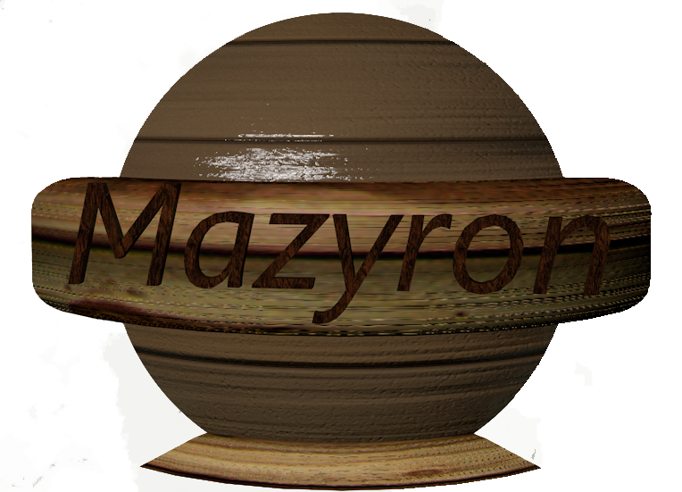

# Mazyron

---

---

### Introducción

Juego basado en el típico tablero de madera con obstáculos y agujeritos donde el objetivo es llegar a la salida sin caer en ninguno de los agujeros intermedios.

---

### Sistema de juego

Las reglas en este juego son realmente simples:

- La bola se mueve mediante las flechas de dirección
- Los obstáculos horizontales son móviles, asique _cuidaditoooooo!!!!_
- La posición de los obstáculos siempre será aleatoria
- Si la bola cae en un agujerito, se pierde el juego
- Si consigues llegar al agujero _amarillo_ se reinicia el escenario y sigues sumando puntos

---

### Problemas encontrados
A pesar de ser un juego muy simple, ha habido varios retos que me ha costado resolver.

*REQUEST ANIMATION FRAME y SET INTERVAL*
El *requestAnimationFrame se encarga de la velocidad del juego, mientras que SetInterval lleva el contador, el cual se reinicia si pierdes la partida, pero suma 10 segundos cada vez que ganas. 
Fue bastante complicado combinar ambos.

*POSICIÓN ALEATORIA DE LOS OBSTÁCULOS*
Que salieran aleatoriamente no llevó mucho tiempo, pero que lo hicieran de una manera coordenada llevó unos cuantos cálculos.

### Logros
El que funcione el juego ya es un logro, al ser el primer juego que hago sin usar un motor de juegos, es decir, todo javascript. Haciéndolo he podido poner en práctica muchas de las lecciones aprendidas, como son los loops, arrays, intervalos de tiempo, comunicación con el DOM, etc. A pesar de ser algo sencillo me ha ayudado a asentar esas bases.